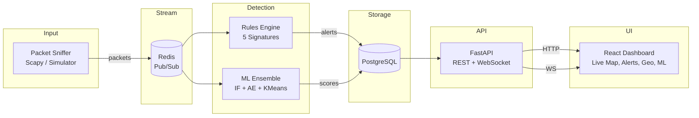

<div align="center">

# NetGuard

**Real-Time Network Attack Detection Platform**

[](https://python.org)
[](https://fastapi.tiangolo.com)
[](https://react.dev)
[](https://postgresql.org)
[](https://redis.io)
[](https://scikit-learn.org)
[](https://docker.com)
[](https://opensource.org/licenses/MIT)

Captures network traffic, detects attacks with rules + ML, and shows everything on a live dashboard. Containerized and self-hosted.

</div>

---

## About

NetGuard is a network intrusion detection platform similar in spirit to CrowdStrike or Splunk but runs locally in Docker. It captures packets, runs a 5-rule detection engine and a 3-model ML ensemble (Isolation Forest, Autoencoder, K-Means), then surfaces everything on a React dashboard.

Most IDS projects stop at port scan detection or a single ML model. This one chains five attack signatures with three unsupervised models whose outputs are combined.

---

## Demo

```bash
git clone https://github.com/dshan12/netguard.git
cd netguard
cp .env.example .env
docker compose up -d
open http://localhost:3000
```

The traffic simulator starts automatically. Alerts appear within seconds.

---

## Architecture



### Data Flow

1. Sniffer captures packets (live via Scapy or simulated) and publishes to Redis
2. Rules engine consumes the stream and applies 5 signature-based detectors
3. ML worker trains an ensemble on recent flow features and scores each IP
4. Both write alerts and scores to PostgreSQL
5. FastAPI serves REST endpoints and streams live data via WebSocket
6. React dashboard renders the live network map, alert timeline, geo map, and ML insights

---

## Detection Engine

| Attack Type | Method | Window | Threshold |
|---|---|---|---|
| Port Scan | Unique destination ports per source IP | 10s | >20 ports |
| DDoS | Packets per second to single target | 5s | >50 pkts/s |
| Brute Force | Auth-port (22/3389/21/23) attempts per flow | 60s | >30 attempts |
| Beaconing | Connection interval regularity (std dev) | 300s | std dev < 0.5s |
| Data Exfiltration | Outbound burst volume + large packet count | 60s | >10KB burst or >3 large packets |

## Machine Learning Ensemble

| Model | Type | Architecture | Role |
|---|---|---|---|
| Isolation Forest | Unsupervised | Recursive partitioning | Global outlier detection |
| Autoencoder | Deep Learning | MLP: 9->12->3->12->9 | Reconstruction error scoring |
| K-Means Clustering | Unsupervised | Dynamic k = n//10 | Centroid distance scoring |

The ensemble weights are 40% Isolation Forest + 30% Autoencoder + 30% Clustering. Alerts record which models agreed.

## Dashboard

- **Live Network Map** -- Canvas particle animation showing IP-to-IP flows in real time
- **Alert Timeline** -- Color-coded by severity (Critical / High / Medium / Low)
- **Geographic Map** -- World map plotting threat source locations
- **Threat Metrics** -- Live packet throughput, alert rates, active threat counts
- **ML Insights** -- Anomaly score distributions, per-model breakdown, ensemble status

---

## Tech Stack

| Layer | Technology |
|---|---|
| Backend | FastAPI, SQLAlchemy 2.0 (async), Pydantic v2 |
| Database | PostgreSQL 16 |
| Stream / Cache | Redis 7 (Pub/Sub + Lists) |
| ML | scikit-learn 1.4 (Isolation Forest, MLPRegressor, KMeans), pandas, numpy |
| Packet Capture | Scapy 2.5 |
| Frontend | React 18, TypeScript 5, Vite 5, Tailwind CSS 3, Recharts |
| Infrastructure | Docker Compose, uv (Python package manager) |

---

## API

| Endpoint | Description |
|---|---|
| `GET /health` | Health check |
| `GET /api/packets/` | Recent packets (paginated) |
| `GET /api/packets/suspicious` | Suspicious packets |
| `GET /api/packets/ip/{ip}` | Packets by IP address |
| `GET /api/alerts/` | Alerts (filterable by severity) |
| `GET /api/alerts/stats` | Alert statistics |
| `POST /api/alerts/{id}/resolve` | Mark alert as resolved |
| `GET /api/threat-actors/` | Top threat actors by score |
| `GET /api/metrics/summary` | Dashboard metrics |
| `GET /api/geo/sources` | Geo-located threat sources |
| `WS /ws/live` | Real-time packet + alert stream |

Full docs at `http://localhost:8000/docs`.

---

## Project Structure

```
netguard/
  docker-compose.yml         7 services
  backend/                   FastAPI application
    main.py                  App entry point
    worker.py                Redis to PostgreSQL consumer
    models/                  SQLAlchemy ORM
    routers/                 API + WebSocket endpoints
    schemas/                 Pydantic models
    services/                Business logic
  sniffer/                   Packet capture + detection
    sniffer.py               Scapy capture + simulation dispatch
    generator.py             6 traffic type generator
    rules_engine.py          5 signature-based rules
  ml-worker/                 Machine learning pipeline
    model.py                 Training + inference loop
    ml_ensemble.py           Ensemble detector (3 models)
    features.py              Per-IP feature extraction
  frontend/                  React dashboard
    src/
      App.tsx                4-tab layout
      components/            NetworkMap, AlertTimeline, GeoMap, MetricsGrid
      pages/                 AlertsPage, MapPage, MLInsightsPage
      hooks/                 useWebSocket
```

---

## Quick Start

### Prerequisites

- [Docker](https://docker.com) and [Docker Compose](https://docs.docker.com/compose/)
- Or [Python 3.12+](https://python.org) with [uv](https://docs.astral.sh/uv/) + [Bun](https://bun.sh) for local development

### Using Docker (recommended)

```bash
git clone https://github.com/dshan12/netguard.git
cd netguard
cp .env.example .env
docker compose up -d
```

Services take about 30 seconds to initialize. Open **http://localhost:3000**.

### Without Docker

```bash
# Terminal 1: Backend
cd backend && uv sync && uv run uvicorn main:app --reload

# Terminal 2: Sniffer (simulation mode)
cd sniffer && SIMULATION_MODE=always uv run python sniffer.py

# Terminal 3: ML Worker
cd ml-worker && uv run python model.py

# Terminal 4: Frontend
cd frontend && bun install && bun run dev
```

Requires PostgreSQL and Redis running locally on default ports.

---

## License

[MIT](LICENSE)
